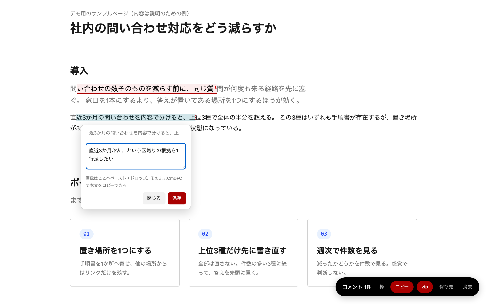

# html-review-loop

AIが生成した自己完結HTMLに、読み手がブラウザ上で直接コメントを入れ、そのコメントをAIへ
渡して直させ、直ったものが自動で「済み」へ落ちる——というレビューの往復を成立させる
仕組み。

HTML側がやることは `</body>` 直前に `<script src>` を1行足すだけ。ビルド不要、
外部CDN・外部フォントへの依存もゼロ。`rv-layer.js` 1ファイルがCSS・DOM・ロジックを
すべて自己注入する。



**動画で見る**（どちらも音声なし・字幕は映像に焼き付け済み）:

- [docs/demo.mp4](docs/demo.mp4) — 74秒。選ぶ→書く→枠→Option+ドラッグで範囲→コピー→済みへ落ちる、まで
- [docs/demo-full.mp4](docs/demo-full.mp4) — 2分40秒。上に加えて、画像添付・枠の粒度（↑↓）・追記と書き直し・
  書きかけの保護・zip・済み一覧と戻す・位置を見失ったコメント・消去まで全部

字幕ファイルは [demo.srt](docs/demo.srt) / [demo.vtt](docs/demo.vtt) と
[demo-full.srt](docs/demo-full.srt) / [demo-full.vtt](docs/demo-full.vtt)。撮り直すときは
[tools/record-demo.mjs](tools/record-demo.mjs)（引数に `full` を付けると全機能版）を走らせると、
動画と字幕の両方が出る。

## これは何をするものか

1. 読み手（人間）が生成物のHTMLをブラウザで開き、気になった箇所を選択してコメントを書く
2. コメントはブラウザの `localStorage`（画像は `IndexedDB`）に溜まる。ページ側のファイルは
   変更されない
3. 「コピー」でコメント一覧をテキストとしてクリップボードに、「zip」で画像込みの
   zipとしてダウンロードできる。これをAI（Claude Code、Codex、Cursor など）へ渡す
4. AIが修正し、対応したコメントのIDを `window.__rvResolved` として改訂版HTMLへ埋め込む
5. 次に開いたとき、対応済みのコメントは自動で「済み」へ落ちる（表示だけ消えるのではなく、
   状態として記録される。「戻す」で再オープンもできる）

## 導入

`rv-layer.js` を対象HTMLから辿れる場所に置き、`</body>` 直前に1行足す。

```html
<script src="rv-layer.js"></script>
</body>
```

`src` は **対象HTMLから見た相対パス**。上の例は `rv-layer.js` を対象HTMLと同じ
ディレクトリに置いた場合。1階層下のHTMLからリポジトリのルートに置いた
`rv-layer.js` を読むなら `src="../rv-layer.js"` になる（同梱の
`examples/` と `templates/` はこの形）。

これだけ。CSSもDOMもこのスクリプトが自分で作る。既存のページのマークアップやスタイルには
触れない（後述の「予約している名前」を除く）。

## 使い方

### 出す/止める

レイヤーは既定では画面に出ない。**出るかどうかは見る側のブラウザが決める**——
`localStorage` の `rv-layer:enabled` フラグが立っているブラウザでしか描画しない。

| 操作 | 効果 |
|---|---|
| URL末尾に `#rv` を付けて開く | このブラウザで有効化（以降、印なしで開いても出る） |
| URL末尾に `?rv=1` を付けて開く | 同上（`#rv` がツール経由で落ちる場合の保険） |
| URL末尾に `#rv-off` を付けて開く | このブラウザで無効化 |
| URL末尾に `?rv=0` を付けて開く | 同上 |

有効化の印（`#rv` / `?rv=1`）を読んだ直後、`history.replaceState` でURLから消える。
**同じHTMLファイルを人に送っても、相手のブラウザには出ない**（フラグは相手のブラウザに
無いため）。送る前にレイヤーを取り外す作業は要らない。

`localStorage` が使えない環境（一部のプライベートブラウジング等）では、有効化状態を
覚えられないため、開くたびに `#rv` が必要になる。

### コメントの3種類

1. **テキスト選択**: 本文をドラッグ選択すると、その範囲にコメントを付けられる
2. **枠（〔枠〕）**: バーの「枠」ボタン、またはOption+クリックで、表・カード・図など
   要素単位（ブロック）にコメントを付けられる。↑↓キーで対象を外側/内側へ移動できる
3. **切り取り（〔切り取り〕）**: 枠選択モード中にドラッグすると、写真のトリミングのように
   矩形でコメントを付けられる。テキストの一部だけでなく画面上の見た目そのものを指したい
   ときに使う

すべてのコメントに画像を添付できる（ペースト / ドロップ、最大4枚）。

### 初めて開いたときの案内

そのブラウザで初めてレビュー層を出した人にだけ、左下に5ステップの案内が出る。
選ぶ・書く・枠・Option+ドラッグ・コピーを実際にやると次へ進む形で、読むだけの説明ではない。
「次へ」で飛ばせて、「もう出さない」でその場で終わる。見終えた記録は
`localStorage` の `rv-layer:guide` に入るので、同じブラウザなら別のページでも再び出ない。
もう一度見たいときはコンソールで `window.__rv.guide()` を叩く。

### 書き出したzipをAIへ渡す

バーの「zip」を押すと、`review.md`・対象HTMLそのもの（`source/`）・添付画像
（`images/`）をまとめたzipがダウンロードされる。展開するだけで「何を・どう直すか」が
揃う。中身と命名規則は [`specs/review-package.md`](specs/review-package.md) を参照。

このzipをAIへ渡すときの指示文の雛形は [`prompts/apply-review.md`](prompts/apply-review.md)
にある。

### 済み消し込み

AI側が対応を終えたら、改訂版HTMLの `</body>` 直前に次を埋め込む。

```html
<script>window.__rvResolved={rev:"r202608191830",ids:["c1755590000000"]}</script>
```

`rev` は対応するたびに新しい値にする（同じ`rev`は二重適用されない）。`ids` には対応した
コメントの**ID**（表示番号ではない）を入れる。詳しい規約は
[`specs/resolved-contract.md`](specs/resolved-contract.md) を参照。次にページを開くと、
該当コメントが自動で「済み」パネルへ移る。「戻す」で再オープンできる。

## 生成側への指示

AIに「レビュー層が載るHTMLを作らせる」ための指示文の雛形は
[`prompts/generate-html.md`](prompts/generate-html.md) にある。予約されているID・
クラス名の一覧もそこに書いてある（本文側の要素と名前が衝突すると、レイヤーは起動を
中止し画面上部にバナーで警告する）。

## テンプレート

[`templates/digital-agency.html`](templates/digital-agency.html) は、デジタル庁
デザインシステム（DADS）の公開デザイントークンを参照して組んだ自己完結HTMLの雛形。
配色・書体・余白はすべて `:root` のCSSカスタムプロパティに集約してあるので、
上書きすれば別テーマにできる。

**このテンプレートはデジタル庁が作成・監修したものではありません。** 公開されている
デザイントークン（配色・タイポグラフィ・スペーシングの数値）を参照した第三者制作物です。
参照元と取得日はテンプレートファイル冒頭のコメントに明記している。日本語フォントの
正式指定は「Noto Sans JP」だが、本テンプレートは外部フォントを使わない方針のため
システムフォントで代替している。

## 例・テスト

- [`examples/minimal.html`](examples/minimal.html): 最小の導入例
- [`examples/resolved.html`](examples/resolved.html): 済み消し込みの見本
- [`tests/fixtures/`](tests/fixtures/): 「黙って壊れる構造」の回帰確認用HTML5本
- [`tests/manual-checklist.md`](tests/manual-checklist.md): 実機での確認手順

## 使う前に知っておくこと（セキュリティ上の前提）

このスクリプトは、対象HTMLと**同じJavaScriptの権限で動く**。分離された領域は無い。
つまり次のことが成り立つ。

- 対象ページに他のスクリプト（アクセス解析、広告、埋め込みウィジェット、外部ライブラリ）が
  読み込まれていると、**それらはあなたが書いたコメント本文と添付画像を読める**。
  保存先は同一オリジンの `localStorage` と `IndexedDB` で、どちらもページ側から素通しになる
- 同じ経路で、コメントの書き換え・削除もできる
- `window.__rvResolved` はページ側のスクリプトからも設定できる。実際には直っていない
  コメントを「済み」へ落とすことが技術的には可能で、済みになったコメントは
  コピーにも書き出しにも載らなくなる

これは実装の不足ではなく、「1行足すだけで載る」という作り方の裏側で、設計を変えない限り
無くならない。したがって**自分が中身を把握しているページで使うもの**として設計されている。

**向くもの**: 自分やAIが生成した成果物のレビュー、社内資料のレビュー、
外部スクリプトを含まない自己完結HTML。

**向かないもの**: 素性の分からないページ、第三者のスクリプトが多数動いているページ、
コメント自体に秘密が含まれる場面（未公開の数字、個人情報、認証情報）。
機密を扱うなら、コメントに書く内容もその前提で選ぶこと。

## 配色を変える

色はすべてCSSカスタムプロパティになっている。既定値は
[デジタル庁デザインシステムのデザイントークン](https://www.npmjs.com/package/@digital-go-jp/design-tokens)
（`@digital-go-jp/design-tokens` v2.0.1）から取った。対象HTML側で上書きすれば変わる。

```css
:root{
  --rv-accent:#006f83;        /* 主ボタン・枠線（既定: DADS cyan-900） */
  --rv-accent-hover:#008299;  /* 同 hover（DADS cyan-800） */
  --rv-inverse:#000000;       /* バー・トースト等の暗い面 */
  --rv-on-inverse:#ffffff;    /* 暗い面の上の文字 */
  --rv-surface:#ffffff;       /* ポップアップの地 */
  --rv-surface-sub:#f2f2f2;   /* 副次ボタンの地 */
  --rv-border:#cccccc;        /* 罫線 */
  --rv-text:#1a1a1a;          /* 本文 */
  --rv-text-muted:#767676;    /* 補助文 */
  --rv-mark:#e9f7f9;          /* コメントが付いた箇所のハイライト */
  --rv-danger:#ec0000;        /* 位置を見失ったコメントの警告 */
}
```

既定値は、文字が4.5:1以上・UI部品の境界が3:1以上（WCAG 2.2 AA）を満たすように選んである。
**色を変えるときは、変えた後のコントラストを確認すること。**とくに `--rv-accent` は
白文字を載せるので、明るい色にすると基準を割る。

## 動作環境・依存

- 純粋なブラウザJavaScript（ES5相当）。ビルド工程・パッケージマネージャ不要
- 外部CDN・外部フォント・外部画像への依存なし
- コメント保存: `localStorage`（テキスト）、`IndexedDB`（画像原寸）
- 画像添付・zip書き出しに対応していない古いブラウザでは、該当機能だけが劣化する
  （コメント自体は動く）

## レイヤーを完全に取り外したいとき

通常の送付ではレイヤーを外す作業は不要（上記の通り、相手のブラウザには出ない）。
それでも読み込みリクエスト自体を出したくない公開物などでは、付属のCLIで取り外せる。

```
node tools/rv-cli.mjs strip file.html    # 外す（元は file.html.rvbak へ退避）
node tools/rv-cli.mjs restore file.html  # 戻す
node tools/rv-cli.mjs status file.html   # 今どちらか見る
```

`restore` は `.rvbak` が無い場合、`rv-layer.js` の在り処（`tools/` と同じ階層、または
リポジトリのルート）を探して `<script src>` の相対パスを組み立てる。対象HTMLがこの
リポジトリの外にあるときは、そこから `rv-layer.js` までの相対パスが入る（対象HTMLの隣に
`rv-layer.js` を置いて配布する運用なら、`strip` 時の `.rvbak` から戻すのが確実）。

## ライセンス

MIT. [`LICENSE`](LICENSE) 参照。
