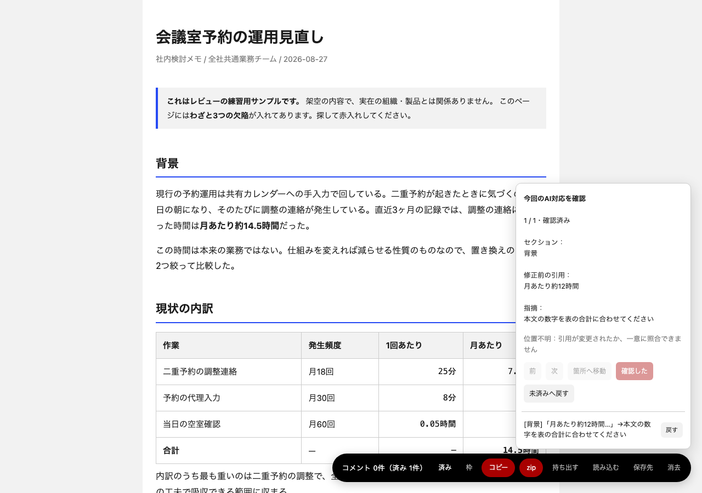

<p align="center">
  
</p>

# Akaire（赤入れ）

紙の原稿に赤ペンで指摘を入れる「赤入れ」を、AIが生成したHTMLの上でそのままやるための道具。

AIが生成した自己完結HTMLに、読み手がブラウザ上で直接コメントを入れ、そのコメントをAIへ
渡して直させ、直ったものが自動で「済み」へ落ちる——というレビューの往復を成立させる
仕組み。

HTML側がやることは `</body>` 直前に `<script src>` を1行足すだけ。ビルド不要、
外部CDN・外部フォントへの依存もゼロ。`rv-layer.js` 1ファイルがCSS・DOM・ロジックを
すべて自己注入する。


- [まず試す](#まず試す)
- [自分のHTMLに入れる](#自分のhtmlに入れる)

## まず試す

GitHubの〈Code〉→〈Download ZIP〉で取得し、ZIPを展開する（clone済みならそのフォルダを使う）。
練習用の [`examples/sample-review.html`](examples/sample-review.html) を
Finderなどからブラウザで開く。macOSならリポジトリのルートで次を実行してもよい。

```sh
open examples/sample-review.html
```

このサンプルは最初から Akaire が表示され、わざと3つの欠陥が入っている。レビュー層が
出ないときは、URL末尾に `#rv` を付けて開く。

1. 本文の気になる文字をドラッグし、コメントを書いて保存する
2. 右下の〈コピー〉を押し、コピーされた赤入れを Claude Code、Codex、Cursor などのAIへ貼る
3. AIに「この赤入れに沿って `examples/sample-review.html` を修正して」と頼む。1件だけ入れた場合は、その1件だけを直して済み印を入れる
4. 修正後に同じファイルを再読み込みする。対応した指摘が「済み」へ移り、本文の印が消えれば一往復完了

表や図を含む3種類の赤入れまで試す手順と、AIが返す「済み」印の仕様は
[`prompts/onboarding.md`](prompts/onboarding.md) にある。AI向けの初回案内も同じ手順を参照。
サンプルはブラウザで直接開ける。

## 自分のHTMLに入れる

`rv-layer.js` をHTMLから辿れる場所に置き、`</body>` 直前に1行足す。

```html
<script src="rv-layer.js"></script>
</body>
```

HTMLを開き、URL末尾に `#rv` を付けるとレビュー層が出る。赤入れが終わったら〈コピー〉を押して
AIへ貼り、修正後のHTMLを再読み込みする。AIへ渡す指示文は
[`prompts/apply-review.md`](prompts/apply-review.md)、HTML生成時の指示は
[`prompts/generate-html.md`](prompts/generate-html.md) を使える。相対パスや表示条件の詳細は
下の「導入」「使い方」にある。

**動画で見る**（どちらも音声なし。字幕ファイルを対応するプレイヤーで読み込んで見る）:

- [docs/demo.mp4](docs/demo.mp4) — 71秒。選ぶ→書く→枠→Option+ドラッグで範囲→コピー→済みへ落ちる、まで
- [docs/demo-full.mp4](docs/demo-full.mp4) — 2分39秒。上に加えて、画像添付・枠の粒度（↑↓）・追記と書き直し・
  書きかけの保護・zip・済み一覧と戻す・位置を見失ったコメント・消去まで全部

字幕ファイルは [demo.srt](docs/demo.srt) / [demo.vtt](docs/demo.vtt) と
[demo-full.srt](docs/demo-full.srt) / [demo-full.vtt](docs/demo-full.vtt)。動画・字幕・先頭画像を
撮り直す手順は [`docs/demo-production.md`](docs/demo-production.md) に分けてある。

## これは何をするものか

1. 読み手（人間）が生成物のHTMLをブラウザで開き、気になった箇所を選択してコメントを書く
2. コメントはブラウザの `localStorage`（画像は `IndexedDB`）に溜まる。ページ側のファイルは
   変更されない
3. 「コピー」でコメント一覧をテキストとしてクリップボードに、「zip」で画像込みの
   zipとしてダウンロードできる。これをAI（Claude Code、Codex、Cursor など）へ渡す
4. AIが修正し、対応したコメントのIDを `window.__rvResolved` として改訂版HTMLへ埋め込む
5. 次に開いたとき、対応済みのコメントは自動で「済み」へ落ちる（表示だけ消えるのではなく、
   状態として記録される。「戻す」で再オープンもできる）

## 導入

`rv-layer.js` を対象HTMLから辿れる場所に置き、`</body>` 直前に1行足す。

```html
<script src="rv-layer.js"></script>
</body>
```

`src` は **対象HTMLから見た相対パス**。上の例は `rv-layer.js` を対象HTMLと同じ
ディレクトリに置いた場合。1階層下のHTMLからリポジトリのルートに置いた
`rv-layer.js` を読むなら `src="../rv-layer.js"` になる（同梱の
`examples/` と `templates/` はこの形）。

これだけ。CSSもDOMもこのスクリプトが自分で作る。既存のページのマークアップやスタイルには
触れない（後述の「予約している名前」を除く）。
この時点では画面に何も出ない。URL末尾に `#rv` を付けて開くと表示される。
出す/止める仕組みの詳細は次節にある。

## 使い方

### 出す/止める

レイヤーは既定では画面に出ない。**出るかどうかは見る側のブラウザが決める**——
`localStorage` の `rv-layer:enabled` フラグが立っているブラウザでしか描画しない。

| 操作 | 効果 |
|---|---|
| URL末尾に `#rv` を付けて開く | このブラウザで有効化（以降、印なしで開いても出る） |
| URL末尾に `?rv=1` を付けて開く | 同上（`#rv` がツール経由で落ちる場合の保険） |
| URL末尾に `#rv-off` を付けて開く | このブラウザで無効化 |
| URL末尾に `?rv=0` を付けて開く | 同上 |

### 作る側から既定を変える

レビューしてほしくて渡すHTMLには、読み込み行に1語足せる。

```html
<script src="rv-layer.js" data-rv-default="on"></script>
```

この指定があるページは、**開いた人のブラウザに何の記録が無くても最初から出る**。
渡す相手に `#rv` の打ち方を伝えなくてよくなるので、zipやメール添付で「ここ直して」と
渡す用途に向く。付けなければ従来どおり黙って始まるので、読んでもらうだけのHTMLは
そのままでよい。

見る側の明示指定はこの指定より強い。既定ONのページでも `#rv-off` で止められ、
その判断は同じオリジンの以後のページに残る（`rv-layer:enabled` に `0` が入る）。
逆に、既定ONのページを開いただけでは**フラグは立たない**ので、同じオリジンにある
指定なしのページが釣られて出ることはない。

| そのブラウザの記録 | `data-rv-default` なし | `data-rv-default="on"` |
|---|---|---|
| 何も無い（初めて） | 出ない | **出る** |
| `#rv` を打った後 | 出る | 出る |
| `#rv-off` を打った後 | 出ない | 出ない |

**付ける先と付けない先**。この1語は、外部へ出すHTMLに残ると相手の画面にレビューUIが
出てしまう。付け忘れは読み手が `#rv` を打てば回復できるが、付いたまま出すと取り消せない。
既定では付けず、次の両方に当てはまるときだけ付ける。

- 読むのが自分自身か、レビューを頼んでいる相手である
- 外部へ配る予定がない、または配る前に外すと分かっている

生成AIに書かせる場合の判断基準は `prompts/generate-html.md` に同じ形で書いてある。
公開・納品の前は次のコマンドで確認できる。

```
node tools/rv-cli.mjs status <file.html>    # 層と既定ONの状態を表示するだけ（変更しない）
node tools/rv-cli.mjs strip  <file.html>    # 層ごと外す（元は .rvbak へ）
```

層を残して既定ONだけ外す場合は、読み込み行から `data-rv-default="on"` の1語を手で消す。
`strip` は属性だけでなく読み込み行ごと外す、層を完全に取り外したいときの別の操作。

有効化の印（`#rv` / `?rv=1`）を読んだ直後、`history.replaceState` でURLから消える。
**同じHTMLファイルを人に送っても、相手のブラウザには出ない**（フラグは相手のブラウザに
無いため）。送る前にレイヤーを取り外す作業は要らない。

`localStorage` が使えない環境（一部のプライベートブラウジング等）では、有効化状態を
覚えられないため、開くたびに `#rv` が必要になる。

### コメントの3種類

1. **テキスト選択**: 本文をドラッグ選択すると、その範囲にコメントを付けられる。
   既存の印はクリックするとそのコメントを開き、印の上をドラッグすると独立した新規コメントになる
2. **枠（〔枠〕）**: バーの「枠」ボタン、またはOption+クリックで、表・カード・図など
   要素単位（ブロック）にコメントを付けられる。↑↓キーで対象を外側/内側へ移動できる
3. **切り取り（〔切り取り〕）**: 写真のトリミングのように矩形でコメントを付けられる。
   テキストの一部だけでなく画面上の見た目そのものを指したいときに使う。入り方は2つあり、
   バーの「枠」ボタンを押してからドラッグするか、Option（Windows / Linux では Alt）を
   押しながらドラッグする。キーを覚えていなくてもボタンから辿り着ける

すべてのコメントに画像を添付できる（ペースト / ドロップ、最大4枚）。

### コメント欄を動かす

コメント欄は選んだ範囲のすぐ下（入らなければ上）に出る。指摘したい箇所そのものに
重なって前後が読めないときは、**上部の引用文の帯を掴んでドラッグする**と好きな位置へ
動かせる。書きかけの本文・添付・追記はそのまま残る。

動かした位置はその1回だけで、閉じれば既定の配置に戻る。次のコメントは別の場所に付くので、
前回の位置を覚えていると対象から離れたところに出てしまうため。

### 初めて開いたときの案内

そのブラウザで初めてレビュー層を出した人にだけ、左下に6ステップの案内が出る。
選ぶ・書く・動かす・枠・Option+ドラッグ・コピーを実際にやると次へ進む形で、読むだけの
説明ではない。最後に、この層の止め方（`#rv-off`）と戻し方（`#rv`）を1回だけ言う
（どちらも画面には出ないため）。
「次へ」で飛ばせて、「もう出さない」でその場で終わる。見終えた記録は
`localStorage` の `rv-layer:guide` に入るので、同じブラウザなら別のページでも再び出ない。
もう一度見たいときはコンソールで `window.__rv.guide()` を叩く。

### 書き出したzipをAIへ渡す

バーの「zip」を押すと、`review.md`・対象HTMLそのもの（`source/`）・添付画像
（`images/`）をまとめたzipがダウンロードされる。展開するだけで「何を・どう直すか」が
揃う。中身と命名規則は [`specs/review-package.md`](specs/review-package.md) を参照。

このzipをAIへ渡すときの指示文の雛形は [`prompts/apply-review.md`](prompts/apply-review.md)
にある。

### 別のファイル名・ブラウザへレビューを持ち越す

バーの〈持ち出す〉で、未済み・済みのコメント、追記、添付画像を1つのレビューJSONへ保存する。
別のブラウザでは対象HTMLを開き、〈読み込む〉でそのファイルを選ぶ。表示されたページ名を
確認して読み込むと、指摘と済み状態を引き継げる。HTML本体と `rv-layer.js` は別に渡す。

既存コメントがあるページへの上書きは行わない。原寸画像を取得・保存できない場合も完了扱いに
せず、理由を表示する。持ち出しファイルの上限は50 MiB。AIへ未済みの指摘を渡す〈zip〉と
〈コピー〉は従来どおり使える。詳しい制約は [`specs/portability.md`](specs/portability.md) を参照。

同じブラウザ・同じオリジンで、改訂版のファイル名を変えても自動で引き継ぎたい場合は、
元のHTMLと改訂版で同じ文書IDを指定する。

```html
<script src="rv-layer.js" data-rv-doc-id="proposal-20260906"></script>
```

文書IDは英数字で始まる128文字以内の英数字・`.`・`_`・`-`。同じ文書の改訂では維持し、
別文書を作るときは別IDにする。既存HTMLへ初めてIDを足すと、そのパスに保存済みのレビューを
移行する。IDを付けないHTMLは従来どおりパス別に保存する。

### 済み消し込み

AI側が対応を終えたら、改訂版HTMLの `</body>` 直前に次を埋め込む。

```html
<script>window.__rvResolved={rev:"r20260819183055",ids:["c17878118744286u5z1"]}</script>
```

`rev` は対応するたびに新しい値にする（同じ`rev`は二重適用されない）。`ids` には対応した
コメントの**ID**（表示番号ではない）を入れる。詳しい規約は
[`specs/resolved-contract.md`](specs/resolved-contract.md) を参照。次にページを開くと、
該当コメントが自動で「済み」パネルへ移る。「戻す」で再オープンできる。
`__rvResolved` へ**代入している**インラインscriptが2個以上ある場合は、最後の1個しか効かない
ことと、古いタグを消して1個へ統合する必要があることをトーストで警告する。処理自体は止めず、
最後のタグを従来どおり使う。名前が文字列として出てくるだけのscriptや `src` 付きのscriptは
数えない（`rv-layer.js` をインラインへ展開しても誤警告にならない）。

### 今回のAI修正を確認する

改訂版を開いたら、〈済み〉の一覧にある「今回のAI対応を確認」で、今回対応した指摘を
1件ずつ読む。修正前の引用と指摘・追記を見ながら〈前〉〈次〉で移り、内容がよければ
〈確認した〉、まだ直っていなければ〈未済みへ戻す〉を選ぶ。

元の引用から場所を一意に特定できる場合は、その箇所へ移動できる。引用が書き換わっている
場合などは「位置不明」と表示するので、修正後の本文を確認する。「済み」はAIが対応した状態、
「確認済み」は読み手が確認した状態として別に記録する。確認せず閉じても指摘は消えない。



## 生成側への指示

AIに「レビュー層が載るHTMLを作らせる」ための指示文の雛形は
[`prompts/generate-html.md`](prompts/generate-html.md) にある。予約されているID・
クラス名の一覧もそこに書いてある（本文側の要素と名前が衝突すると、レイヤーは起動を
中止し画面上部にバナーで警告する）。

## テンプレート

[`templates/digital-agency.html`](templates/digital-agency.html) は、デジタル庁
デザインシステム（DADS）の公開デザイントークンを参照して組んだ自己完結HTMLの雛形。
配色・書体・余白はすべて `:root` のCSSカスタムプロパティに集約してあるので、
上書きすれば別テーマにできる。

**このテンプレートはデジタル庁が作成・監修したものではありません。** 公開されている
デザイントークン（配色・タイポグラフィ・スペーシングの数値）を参照した第三者制作物です。
参照元と取得日はテンプレートファイル冒頭のコメントに明記している。日本語フォントの
正式指定は「Noto Sans JP」だが、本テンプレートは外部フォントを使わない方針のため
システムフォントで代替している。

## 例・テスト

- [`examples/minimal.html`](examples/minimal.html): 最小の導入例
- [`examples/resolved.html`](examples/resolved.html): 済み消し込みの見本
- [`examples/sample-review.html`](examples/sample-review.html): レビューを1周する練習用サンプル（欠陥3つ入り。[`prompts/onboarding.md`](prompts/onboarding.md) から使う）
- [`tests/fixtures/`](tests/fixtures/): 「黙って壊れる構造」の回帰確認用HTML5本
- [`tests/manual-checklist.md`](tests/manual-checklist.md): 実機での確認手順

clone直後は依存パッケージとPlaywright用のChromiumを入れてから、テストを走らせる。

```
npm install
npx playwright install chromium
npm test
```

テストは次のように個別にも走らせられる。

```
npm run test:static    # ブラウザ不要。ファイル同士の食い違いを突き合わせる
npm run test:browser   # サンプルを実ブラウザで開き、往復を1周させる（playwright が要る）
npm run test:images    # 画像の添付と取り外しがIndexedDBの実体まで一致するか（同上）
npm run test:environment # body transformの座標とIndexedDB拒否時のデータ保護（同上）
npm run test:portability # レビューの持ち出し・読み込みと保存失敗時の保護
npm run test:revision-review # 今回のAI修正の確認と未済みへの戻し
npm run test:mvp       # 赤入れ→AI修正確認→別ブラウザへ持ち越す一往復
```

`npm run test:static` はNode.jsの組み込み機能だけを使うため、`npm install` 前でも走る。

静的チェックが見るのは「実際に一度やらかした型」だけ——ガイドのステップと進行の
呼び出しの食い違い、版数4箇所のずれ、`rev` の案内が分止まりになっていないか、
予約IDが実装と生成側の雛形で揃っているか、同梱HTMLが読み込み行を持っているか。
実走チェックは、層の表示・文字/枠/切り取りの3種・印上ドラッグ・コピー文のID・
`__rvResolved` による済み落ちを通しで確かめる。環境回帰チェックは、transformされたbody上の
矩形位置と、IndexedDB APIは存在するがopenに失敗する場合の警告・本文保持を確かめる。

## 使う前に知っておくこと（セキュリティ上の前提）

このスクリプトは、対象HTMLと**同じJavaScriptの権限で動く**。分離された領域は無い。
つまり次のことが成り立つ。

- 対象ページに他のスクリプト（アクセス解析、広告、埋め込みウィジェット、外部ライブラリ）が
  読み込まれていると、**それらはあなたが書いたコメント本文と添付画像を読める**。
  保存先は同一オリジンの `localStorage` と `IndexedDB` で、どちらもページ側から素通しになる
- 同じ経路で、コメントの書き換え・削除もできる
- `window.__rvResolved` はページ側のスクリプトからも設定できる。実際には直っていない
  コメントを「済み」へ落とすことが技術的には可能で、済みになったコメントは
  コピーにも書き出しにも載らなくなる

これは実装の不足ではなく、「1行足すだけで載る」という作り方の裏側で、設計を変えない限り
無くならない。したがって**自分が中身を把握しているページで使うもの**として設計されている。

**向くもの**: 自分やAIが生成した成果物のレビュー、社内資料のレビュー、
外部スクリプトを含まない自己完結HTML。

**向かないもの**: 素性の分からないページ、第三者のスクリプトが多数動いているページ、
コメント自体に秘密が含まれる場面（未公開の数字、個人情報、認証情報）。
機密を扱うなら、コメントに書く内容もその前提で選ぶこと。

## 配色を変える

色はすべてCSSカスタムプロパティになっている。既定値は
[デジタル庁デザインシステムのデザイントークン](https://www.npmjs.com/package/@digital-go-jp/design-tokens)
（`@digital-go-jp/design-tokens` v2.0.1）から取った。対象HTML側で上書きすれば変わる。

```css
:root{
  --rv-accent:#a90000;        /* 主ボタン・枠線（既定: DADS red-1000） */
  --rv-accent-hover:#ce0000;  /* 同 hover（DADS red-900） */
  --rv-inverse:#000000;       /* バー・トースト等の暗い面 */
  --rv-on-inverse:#ffffff;    /* 暗い面の上の文字 */
  --rv-surface:#ffffff;       /* ポップアップの地 */
  --rv-surface-sub:#f2f2f2;   /* 副次ボタンの地 */
  --rv-border:#cccccc;        /* 罫線 */
  --rv-text:#1a1a1a;          /* 本文 */
  --rv-text-muted:#767676;    /* 補助文 */
  --rv-mark:#fdeeee;          /* コメントが付いた箇所のハイライト（DADS red-50） */
  --rv-mark-hover:#ffdada;    /* 同 hover（DADS red-100） */
  --rv-danger:#c74700;        /* 位置を見失ったコメントの警告（DADS orange-800） */
  --rv-danger-bg:#ffeee2;     /* 同 背景（DADS orange-50） */
}
```

既定値は、文字が4.5:1以上・UI部品の境界が3:1以上（WCAG 2.2 AA）を満たすように選んである。
**色を変えるときは、変えた後のコントラストを確認すること。**とくに `--rv-accent` は
白文字を載せるので、明るい色にすると基準を割る。

赤は「人が入れた指摘」、橙は「位置を見失って照合できなかったコメント」に割り当ててある。
DADSでは赤 `#ec0000`（red-800）がエラーの意味を持つため、指摘のアクセントには一段深い
red-1000 を使い、機械が出す警告は橙へ逃がしている。

## 動作環境・依存

- 構文はES5相当で、ビルド工程・パッケージマネージャ不要。ただしpolyfillは同梱せず、
  `Promise`、`String.prototype.padStart`、`Element.closest`、`classList`、`dataset`、
  `Element.remove` などのブラウザAPIに依存する
- 外部CDN・外部フォント・外部画像への依存なし
- コメント保存: `localStorage`（テキスト）、`IndexedDB`（画像原寸）
- `Promise` は読み込み時に評価するため、無い環境では層全体が起動しない。他の必須APIが
  無い場合も初期化中または操作中に停止し、コメントだけが動くフォールバックにはならない
- `data-rv-doc-id` 未指定時は、コメントの保存先を分ける文書識別子に `location.pathname` を使い、クエリとハッシュは
  含めない。同じパスの `/preview?id=a` と `/preview?id=b` はコメントを共有する。クエリと
  ハッシュには層自身の `?rv=1` / `#rv` も同居し、含めると有効化のたびに別のコメント集合へ
  分かれるため、パスだけに固定している

## レイヤーを完全に取り外したいとき

通常の送付ではレイヤーを外す作業は不要（上記の通り、相手のブラウザには出ない）。
それでも読み込みリクエスト自体を出したくない公開物などでは、付属のCLIで取り外せる。

```
node tools/rv-cli.mjs strip file.html    # 外す（元は file.html.rvbak へ退避）
node tools/rv-cli.mjs restore file.html  # 戻す
node tools/rv-cli.mjs status file.html   # 今どちらか見る
```

`restore` は `.rvbak` が無い場合、`rv-layer.js` の在り処（`tools/` と同じ階層、または
リポジトリのルート）を探して `<script src>` の相対パスを組み立てる。対象HTMLがこの
リポジトリの外にあるときは、そこから `rv-layer.js` までの相対パスが入る（対象HTMLの隣に
`rv-layer.js` を置いて配布する運用なら、`strip` 時の `.rvbak` から戻すのが確実）。

## サードパーティ

配色・タイポグラフィ・スペーシングの数値は、デジタル庁デザインシステムの
[`@digital-go-jp/design-tokens` v2.0.1](https://www.npmjs.com/package/@digital-go-jp/design-tokens)
を参照している。出典のライセンスはMIT。本リポジトリはデジタル庁が作成・監修したものではない。

## ライセンス

MIT. [`LICENSE`](LICENSE) 参照。
